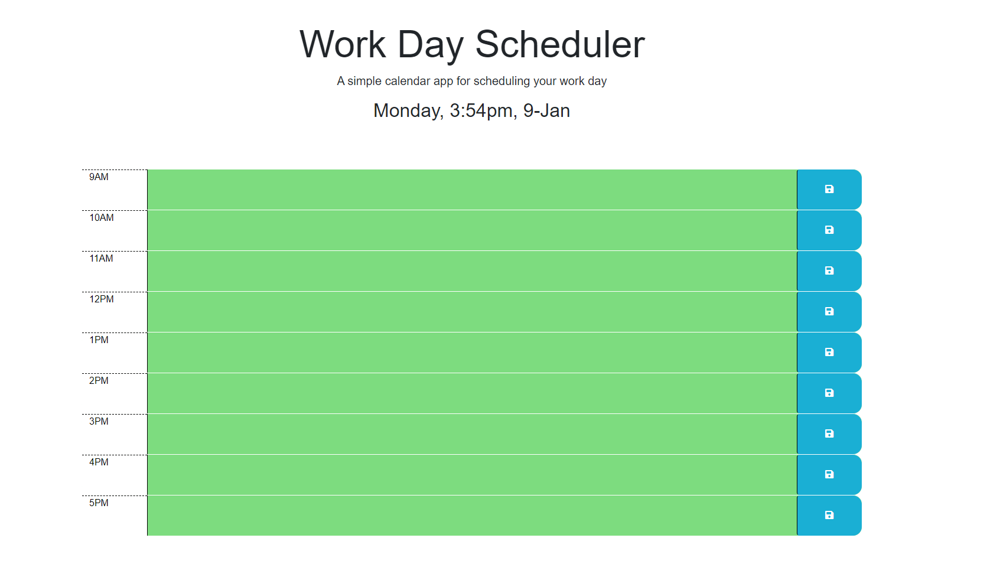

# Work-Day-Scheduler

## Description
Basic work day scheduler that uses Bootstrap, Jquery, and Day.js. Depending on the time of day the blocks will change colors to keep an easier track on time and tasks.

## Usage

The header will contain the current time and underneath it will have time blocks with incriments of 1 starting from 9am to 5pm.
Depending on what the current time it is, those time blocks will have a different color background. For example, past = gray, present = red, and future = green.
This will make it easier to keep track on the tasks.

## Credits

github.com
getbootstrap.com
jquery.com
day.js.org
w3school.com

